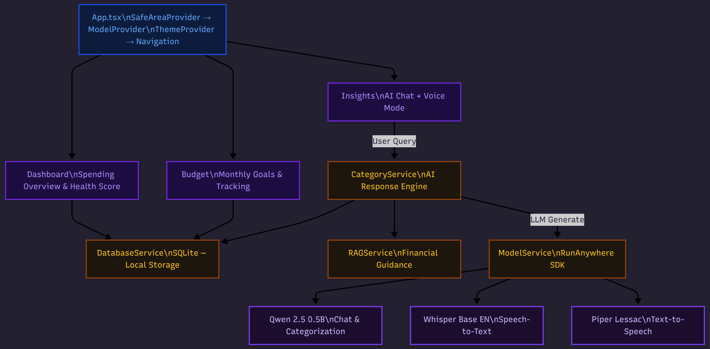

# SpendAI — Fully Offline AI Finance Assistant

> **Zero cloud. Zero data leaves your phone.**
>
> A privacy-first expense tracker powered entirely by on-device AI — LLM, speech-to-text, text-to-speech — all running locally on your phone's processor.

Built with **React Native (Expo)** and **RunAnywhere SDK** for the RunAnywhere Hackathon.

---

## Why SpendAI?

Every finance app today uploads your transaction data to the cloud. SpendAI takes a fundamentally different approach:

- **Complete privacy** — all AI runs on your phone, all data stays in local storage
- **Works offline** — after initial model download, airplane mode works perfectly
- **Voice-first** — ask about your spending with your voice, get spoken answers back
- **Instant insights** — real-time spending analysis, budget tracking, and financial health scoring
- **Smart detection** — auto-reads bank SMS and categorizes expenses with AI

---

## Built with RunAnywhere.ai

This project deeply integrates the RunAnywhere SDK for on-device AI, enabling:

- **Offline voice agent** — full STT → LLM → TTS pipeline runs locally on the phone
- **Qwen2.5 0.5B model** — fast, efficient responses optimized for mobile devices
- **Privacy-first** — all voice processing happens on-device, no cloud dependency
- **Low-latency inference** — real-time conversational experience without network round-trips

RunAnywhere powers the entire AI pipeline — from understanding your voice to generating intelligent financial insights to speaking answers back — making SpendAI reliable anywhere, even without internet.

---

## Promotional Website

Check out our Promotional Website: [**SpendAI**](https://spendai-ttkb.vercel.app/)

---

## Features

### Expense Tracking

- **Manual Entry** — add expenses with numeric input and category picker
- **Transaction History** — view, edit, and delete past expenses grouped by date
- **SMS Auto-Detection** — listens for bank transaction SMS, auto-extracts amounts
- **AI Categorization** — on-device LLM suggests expense categories

### Financial Intelligence

- **AI Chat** — natural language questions about your spending ("How much on food this week?")
- **Budget Planning** — set monthly budgets per category with real-time progress tracking
- **Health Score** — financial health metric based on spending diversity, consistency, and budget adherence
- **Month-End Predictions** — forecasts total spending based on current trajectory
- **Time-Aware Queries** — understands "today", "this week", "this month" and filters accordingly
- **Income Analysis** — set your salary for savings rate and remaining budget calculations

### Voice Mode

- **Push-to-Talk** — tap mic, speak your question, tap stop
- **Editable Transcription** — review and correct before sending
- **Spoken Responses** — AI reads answers aloud
- **Multi-turn Conversations** — continuous Q&A within voice modal

---

## On-Device AI Models

All models download automatically on first launch (~500 MB total) and are cached permanently:

| Model                                 | Purpose                                 | Engine      | Memory |
| ------------------------------------- | --------------------------------------- | ----------- | ------ |
| **Qwen2.5 0.5B Instruct** (Q8_0 GGUF) | Chat, categorization, spending analysis | LlamaCPP    | 700 MB |
| **Whisper Base English** (ONNX)       | Speech-to-Text (16kHz mono)             | Sherpa-ONNX | 150 MB |
| **Piper Lessac Medium** (ONNX)        | Text-to-Speech (US English)             | Sherpa-ONNX | 65 MB  |

- LLM inference: temperature 0.3, max 150 tokens, prompt capped at ~1900 chars for fast response
- STT: Whisper Base provides 23% lower word error rate vs Tiny, still real-time on mobile
- TTS: Neural voice synthesis with direct native playback via react-native-sound

---

## Architecture



---

## Tech Stack

| Layer           | Technology                           |
| --------------- | ------------------------------------ |
| Framework       | Expo ~55.0.8 / React Native 0.83.2   |
| Navigation      | React Navigation 7 (Native Stack)    |
| Database        | expo-sqlite (on-device)              |
| AI Runtime      | RunAnywhere SDK ^0.18.1              |
| LLM             | @runanywhere/llamacpp (Qwen2.5 GGUF) |
| STT / TTS       | @runanywhere/onnx (Whisper + Piper)  |
| Voice Recording | react-native-live-audio-stream       |
| TTS Playback    | react-native-sound                   |
| SMS Detection   | react-native-sms-listener            |
| Icons           | MaterialCommunityIcons               |
| Language        | TypeScript ~5.9.2                    |

---

## Project Structure

```
hackxtreme/
├── App.tsx                              # Entry — providers, navigation, SMS listener
├── src/
│   ├── screens/
│   │   ├── DashboardScreen.tsx          # Home — totals, charts, transactions
│   │   ├── InsightsScreen.tsx           # AI chat + voice mode
│   │   ├── ConfirmTransactionScreen.tsx # Categorize detected transactions
│   │   ├── TransactionDetailScreen.tsx  # Edit/delete transactions
│   │   ├── BudgetScreen.tsx             # Monthly budgets per category
│   │   └── DevScreen.tsx                # Testing & debug tools
│   ├── services/
│   │   ├── ModelService.tsx             # RunAnywhere SDK — LLM, STT, TTS
│   │   ├── DatabaseService.ts           # SQLite CRUD (transactions + budgets)
│   │   ├── CategoryService.ts           # AI response system + prompt engineering
│   │   ├── RAGService.ts               # Financial guidance retrieval
│   │   ├── SMSService.ts               # SMS listener + amount extraction
│   │   ├── HealthScoreService.ts        # Financial health calculator
│   │   └── PredictionService.ts         # Month-end spending forecast
│   ├── components/                      # Reusable UI (charts, cards, pickers)
│   ├── data/
│   │   └── finance_guidance.json        # Financial tips corpus for RAG
│   ├── constants/categories.ts          # Expense categories
│   ├── context/CardExpandContext.tsx     # Shared UI state
│   └── theme/                           # Light & dark color schemes
```

---

## Getting Started

### Prerequisites

- Node.js 18+
- Android Studio with emulator or physical Android device
- Java JDK (bundled with Android Studio)

### Setup

```bash
# 1. Install dependencies
npm install

# 2. Set JAVA_HOME
$env:JAVA_HOME = "C:\Program Files\Android\Android Studio\jbr"

# 3. Build and run
npx expo run:android
```

## Version Constraints

| Dependency                 | Required | Reason                          |
| -------------------------- | -------- | ------------------------------- |
| react-native-nitro-modules | 0.31.10  | RunAnywhere SDK compatibility   |
| Gradle                     | 8.13     | Gradle 9.0+ causes build errors |

---

## Troubleshooting

| Problem                            | Solution                                                        |
| ---------------------------------- | --------------------------------------------------------------- |
| `react-native-sound not available` | Run `npx expo run:android` for a full native rebuild            |
| LLM slow on emulator               | Expected — use a real device for best performance               |
| Models not downloading             | Check internet; `adb logcat \| grep SpendAI` for progress       |
| App crashes on launch              | Must use dev client build (`npx expo run:android`), not Expo Go |

---

## Team

- **Paras Saxena**
- **Sunil Sharma**
- **Mohit Kumar**

---

_All AI inference runs on-device. No data leaves your phone. Ever._
